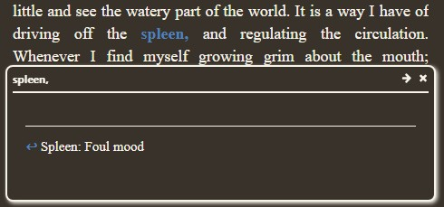

## Power literature

Moby-Dick annotated epub, based on the great efforts of [Power Moby-Dick, The Online Annotation](http://www.powermobydick.com/).
* Highly recommended extras to be found there
  * [Glossary](http://www.powermobydick.com/Moby138.html)
  * [Resources](http://www.powermobydick.com/Moby141.html) including the fascinating background on [How Moby-Dick got his name](http://www.powermobydick.com/Moby147.html)

With front/back material from a [scanned, signed first-edition from the Internet Archive](https://archive.org/details/mobydickorwhale01melv/page/n7/mode/2up).

### Very brief overview
1. Scrape PMD TOC and Chapters
2. Basic HTML clean up, then some deep cleaning and patching to improve the e-reader experience
3. Prep the EPUB content, XHTML chapters
4. Build the EPUB

I test on readers that I have used for a long time, without trying harder for more common devices or apps : )
* Android tablet, with the reliable [Lithium epub reader](https://play.google.com/store/apps/details?id=com.faultexception.reader&hl=en-US).
* iPhone, with the spectacular [Readdle Documents](https://readdle.com/documents).
* Kobo Libra Color. Later versions no longer support popup noterefs. See below.

### Why two .epub files? What's the difference?

Unfortunately, e-readers support notes in different ways.

My preferred android reader, [Lithium epub reader](https://play.google.com/store/apps/details?id=com.faultexception.reader&hl=en-US) handles
* "noteref" notes as pop-up text, which is a great reading experience, and
* "footnote" notes as links to chapter footnotes, which forces the reader to jump around the chapter - a sub-optimal reading experience.

Few e-readers support "noteref" pop-up notes. If your e-reader does not support "noteref" notes, you may prefer the "footnote" EPUB. Although then you may not get popup notes like:

If you can demonstrate WORKING, or WORKING/CONFORMANT syntax for device- and software-agnostic EPUB syntax, please consider donating contributing them to:
* [working](popup-notes/working) ... if popups work on your OS and software, one way or another, or
* [conformant](popup-notes/conformant) ... if popups work and syntax **conforms** to a recognized standard.
* *no copyrighted content, please. just working syntax like the others*

### Contribute
Suggestions welcome to improve the epub experience, and to further clean up the content. Something not work on your reader? Please report it. 

Check the config.yaml, and set `debugging: True` to work on isolated modifications.

With respect and gratitude for Herman and Margaret. This is what I can offer.

-- DDT
