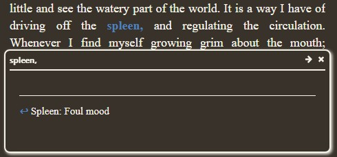

## Footnotes 😃 vs. Hyperlinks 😒

Popup [footnotes](https://www.w3.org/TR/epub-ssv-11/#notes), from [EPUB 3.3](https://www.w3.org/TR/epub-ssv-11/), ensure a great, seamless reading experience.

Unfortunately, e-reader devices and apps don't reliably deliver these.

**Hyperlinks** is a lesser alternative, for readers to access non-linear content that is separate from the main text -- like footnotes and endnotes.

* Links force the reader to jump around the content - a disruptive, sub-optimal reading experience.
* Some ebook publishers use hyperlinks; some e-readers convert footnotes to hyperlinks.
* Both approaches seem like unfortunate decisions to deliver disruptive, sub-optimal reading experiences.

### Spotty popup support by device manufacturers and app developers

Few e-readers support popup footnotes reliably. My preferred Windows and Android readers, mentioned in the [README](./README.md), do.

If your e-reader does not support popups, you may have better luck with the "hyperlink" epub edition. Don't expect popups like:

  * 

### Key points from EPUB 3 standards

A few key points from [EPUB 3.3](https://www.w3.org/TR/epub-ssv-11/)
* [skippability and escapability matter](https://www.w3.org/TR/epub-33/#sec-behaviors-skip-escape) can confuse since, distinct from skippable, escapable items are those "that users might wish to skip" ... 
  * Wait, whaaa... ?!
* Nonetheless, footnotes are skippable. And popups are the best experience to ensure readers don't want to skip them.
* So footnotes matter and are detailed in [EPUB 3 Structural Semantics Vocabulary 1.1, footnotes](https://www.w3.org/TR/epub-ssv-11/#notes) and [noterefs](https://www.w3.org/TR/epub-ssv-11/#links)
  * epub:type="noteref" belongs in HTML `<a>` tags "in the main body of text."
  * epub:type="footnote" belongs in HTML `<aside>` tags to provide the reader "ancillary information ... that provides additional context" to that main text.

**Note:** [EPUB 3](https://www.w3.org/TR/epub-ssv-11/) !!
* Tools like [Calibre ebook reader, validator and builder](https://calibre-ebook.com/) can upgrade ebook internals from EPUB 2 to EPUB 3,
* So that epub validators like [w3.org's EpubCheck](https://www.w3.org/publishing/epubcheck/docs/messages/#message-codes) analyze footnotes and endnotes correctly.

### Footnotes, EPUB 3

The simplest case for popup footnotes seems pretty simple. **Note** that footnotes are in the same ebook file:
```
<div id="text">
    <a id="txt01" epub:type="noteref" href="#fn01">
        Main body of text
    </a>
    without the interesting, skippable bits.
</div>
...
<div id="footnotes">
    <aside epub:type="footnote" id="fn01">
        <a href="#txt01">back ↩</a>
        Skippable details and
        <a href="http://wikipedia.com">more on Wikipedia</a>
    </aside>
</div>
```

### Endnotes variation, EPUB 3

Endnotes are particularly useful for Glossaries, which are "many-to-one" annotations: multiple references throughout a main text refer to a single, centralized note. The main text links to a specific term and note, which can rarely link back to a single reference in the main text. 

*(Some ebook authors simply link a glossary term back to the first appearance in the main text, causing the reader trouble when they encounter that same term the second time, 100 pages later in the main text.)* 

Popup endnotes ensure a great reader experience, since they easily support "many-to-one" annotations. **Note** that endnotes are therefore centralized to a separate ebook file.

main text file, `main-text.xhtml`:
```
<div id="text">
    <a id="txt01" epub:type="noteref" href="endnotes.xhtml#en01">
        Main body of text
    </a>
    without the interesting, skippable bits.
</div>
```

endnotes file, `endnotes.xhtml`:
```
<section id="endnotes" role="doc-endnotes">
    <aside id="en01" epub:type="endnote">
        <a href="main-text.xhtml#txt01">back ↩</a>
        Skippable details and
        <a href="http://wikipedia.com">more on Wikipedia</a>
    </aside>
</section>
```
